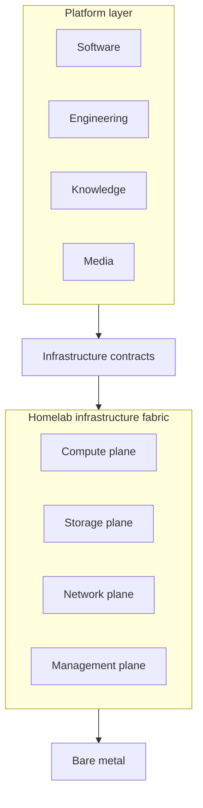

# Homelab

Homelab is a **private infrastructure fabric** that provides compute, storage,
networking, and virtualization for the Software, Engineering, Knowledge, and
Media platforms.

## Scope

This repository describes and, later, may provision the infrastructure
capacity behind those platforms: physical machines, virtualization, compute,
storage, network, and infrastructure management.

Application source code, research and engineering projects, and media library
content belong to their platform or project repositories. Homelab records the
infrastructure contracts those workloads need; it does not own the workloads.

## Repository layers

| Path | Purpose |
| --- | --- |
| [inventory/](inventory/) | Reported physical and network facts, with verification status and source. |
| [architecture/](architecture/) | Desired platform boundary, infrastructure planes, and workload contracts. |
| [provisioning/](provisioning/) | The intended path from manually bootstrapped metal to generic capacity. |
| [STATE.md](STATE.md) | Facts directly verified against the live environment. |
| [diagrams/](diagrams/) | Platform, physical inventory, and network views. |
| [docs/legacy/](docs/legacy/) | Preserved v1 records that came from an unverified diagram. |

Inventory records inherited from the old diagram are explicitly marked
unverified. They are leads for a future live inventory pass, not current-state
claims. Architecture documents describe intent and do not assert that the
design has been implemented. No IaC is present yet.

## Start here

- [Architecture overview](architecture/platform.md)
- [Current state](STATE.md)
- [Provisioning lifecycle](provisioning/README.md)

## Diagrams

- [Platform boundary](diagrams/platform.drawio)
- [Reported physical inventory](diagrams/physical.drawio)
- [Logical and reported network](diagrams/network.drawio)
